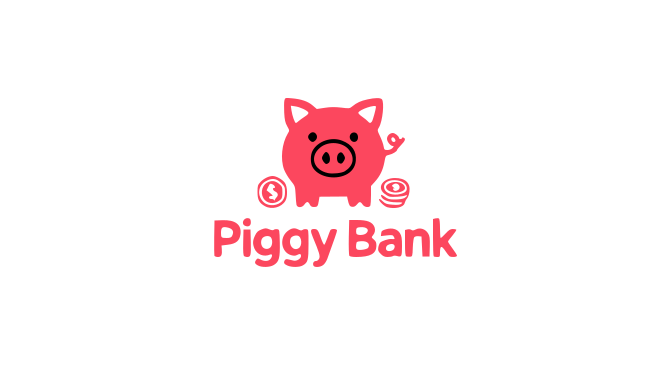

# 🐷 Piggy Bank

  

## Description

Piggy Bank is a personal finance management system that combines a Telegram bot and a React-based web application.
It helps users track accounts, transactions, and other personal financial activity.

## Overview

Piggy Bank provides a unified way to manage:

- accounts and balances
- income and expenses
- categories and subcategories
- financial goals
- investments

User interaction is primarily handled through a Telegram bot for fast data entry, while the web application serves as a management and analytics interface.

## Features

### Implemented
#### Telegram Bot:
- Add income and expense transactions
- Select accounts and categories
- Fast, minimal interaction flow

#### Accounts:
- Multiple accounts per user
- Balance tracking with currency support
- Account activation and deactivation

#### Categories:
- System and user-defined categories
- Hierarchical categories (parent / child)
- Category types: income / expense

#### Transactions:
- Income and expense records
- Tags and descriptions
- Metadata support
- Edit restrictions based on business rules

### Planned
#### Web Application (React):
- Account and category management
- Transaction history
- Financial dashboards and charts

#### Savings Goals:
- Goal definition and progress tracking
- Time-based planning
- Account association

#### Investments:
- Asset tracking
- Performance calculation
- Long-term statistics

#### Analytics & Reports:
- Category-based expense analysis
- Period comparisons (month / year)
- Aggregated financial insights

## Architecture

The system follows a domain-driven design (DDD) approach:

- Core business logic is isolated from infrastructure and UI
- Entities encapsulate behavior, not just data
- Value Objects are immutable and expressive
- Aggregates enforce consistency boundaries

### High-Level Components

#### Backend
- Domain layer (entities, value objects, business rules)
- Application layer (use cases)
- Infrastructure layer (persistence, integrations)

#### Telegram Bot
- Primary data input interface
- Orchestrates application use cases

#### Frontend (React)
- Visualization and management
- Read-oriented views and user controls

### Diagrams:
- [Class Diagram](docs/class-diagram.md)
- [Entity Relationship Diagram](docs/entity-relationship-diagram.md)

## Technology Stack

### Backend
- TypeScript
- Node.js
- NestJS
- PostgreSQL
- Drizzle ORM

### Frontend
- React
- TypeScript

### Integrations
- Telegram Bot API

## Project Status

The project is under active development.
Some features are partially implemented or planned, while the core domain model and architecture are already defined.

Breaking changes are possible as the system evolves.

## Stay in touch

- Telegram: [@tonycarbanana](https://t.me/tonycarbanana)
- Email: plotnikov12341@gmail.com

## License

This project is licensed under the MIT License.
