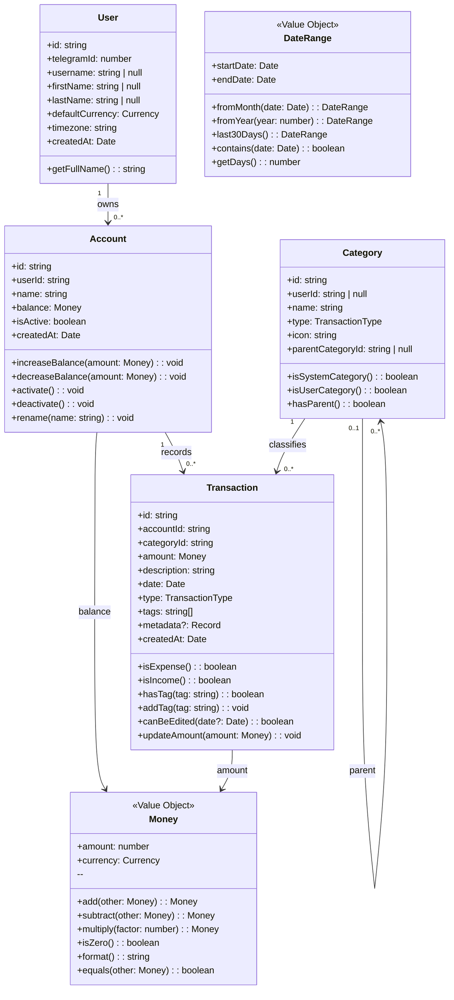

```mermaid
classDiagram
direction TB

    %% ===== Core Entities =====
    class User {
        +id: string
        +telegramId: number
        +username: string | null
        +firstName: string | null
        +lastName: string | null
        +defaultCurrency: Currency
        +timezone: string
        +createdAt: Date

        +getFullName(): string
    }

    class Account {
        +id: string
        +userId: string
        +name: string
        +balance: Money
        +isActive: boolean
        +createdAt: Date

        +increaseBalance(amount: Money): void
        +decreaseBalance(amount: Money): void
        +activate(): void
        +deactivate(): void
        +rename(name: string): void
    }

    class Transaction {
        +id: string
        +accountId: string
        +categoryId: string
        +amount: Money
        +description: string
        +date: Date
        +type: TransactionType
        +tags: string[]
        +metadata?: Record
        +createdAt: Date

        +isExpense(): boolean
        +isIncome(): boolean
        +hasTag(tag: string): boolean
        +addTag(tag: string): void
        +canBeEdited(date?: Date): boolean
        +updateAmount(amount: Money): void
    }

    class Category {
        +id: string
        +userId: string | null
        +name: string
        +type: TransactionType
        +icon: string
        +parentCategoryId: string | null

        +isSystemCategory(): boolean
        +isUserCategory(): boolean
        +hasParent(): boolean
    }

    %% ===== Value Objects =====
    class Money {
        <<Value Object>>
        +amount: number
        +currency: Currency
        --
        +add(other: Money): Money
        +subtract(other: Money): Money
        +multiply(factor: number): Money
        +isZero(): boolean
        +format(): string
        +equals(other: Money): boolean
    }

    class DateRange {
        <<Value Object>>
        +startDate: Date
        +endDate: Date

        +fromMonth(date: Date): DateRange
        +fromYear(year: number): DateRange
        +last30Days(): DateRange
        +contains(date: Date): boolean
        +getDays(): number
    }

    %% ===== Relationships =====
    User "1" --> "0..*" Account : owns
    Account "1" --> "0..*" Transaction : records
    Category "1" --> "0..*" Transaction : classifies
    Category "0..1" --> "0..*" Category : parent

    Account --> Money : balance
    Transaction --> Money : amount
```
