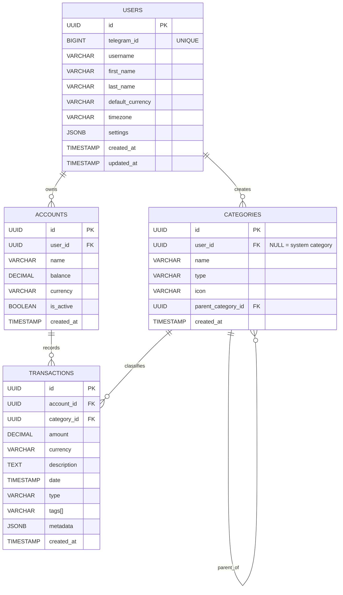

```mermaid
erDiagram
USERS {
UUID id PK
BIGINT telegram_id "UNIQUE"
VARCHAR username
VARCHAR first_name
VARCHAR last_name
VARCHAR default_currency
VARCHAR timezone
JSONB settings
TIMESTAMP created_at
TIMESTAMP updated_at
}

    ACCOUNTS {
        UUID id PK
        UUID user_id FK
        VARCHAR name
        DECIMAL balance
        VARCHAR currency
        BOOLEAN is_active
        TIMESTAMP created_at
    }

    CATEGORIES {
        UUID id PK
        UUID user_id FK "NULL = system category"
        VARCHAR name
        VARCHAR type
        VARCHAR icon
        UUID parent_category_id FK
        TIMESTAMP created_at
    }

    TRANSACTIONS {
        UUID id PK
        UUID account_id FK
        UUID category_id FK
        DECIMAL amount
        VARCHAR currency
        TEXT description
        TIMESTAMP date
        VARCHAR type
        VARCHAR tags[]
        JSONB metadata
        TIMESTAMP created_at
    }

    USERS ||--o{ ACCOUNTS : owns
    USERS ||--o{ CATEGORIES : creates
    ACCOUNTS ||--o{ TRANSACTIONS : records
    CATEGORIES ||--o{ TRANSACTIONS : classifies
    CATEGORIES ||--o{ CATEGORIES : parent_of
```
